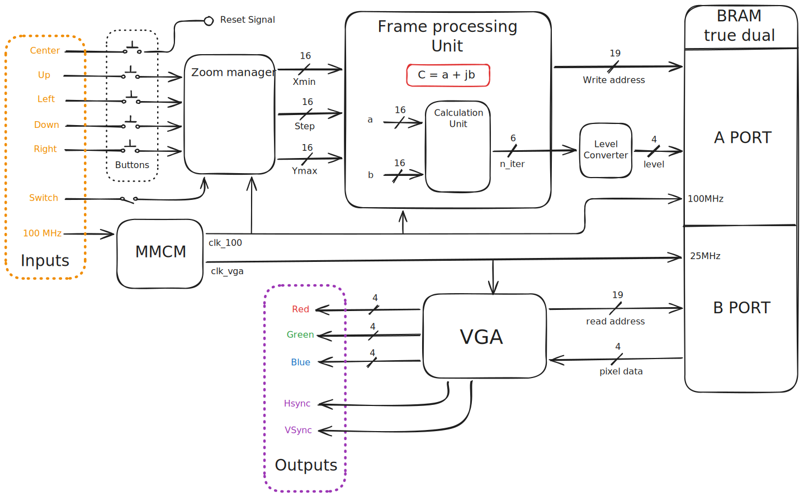
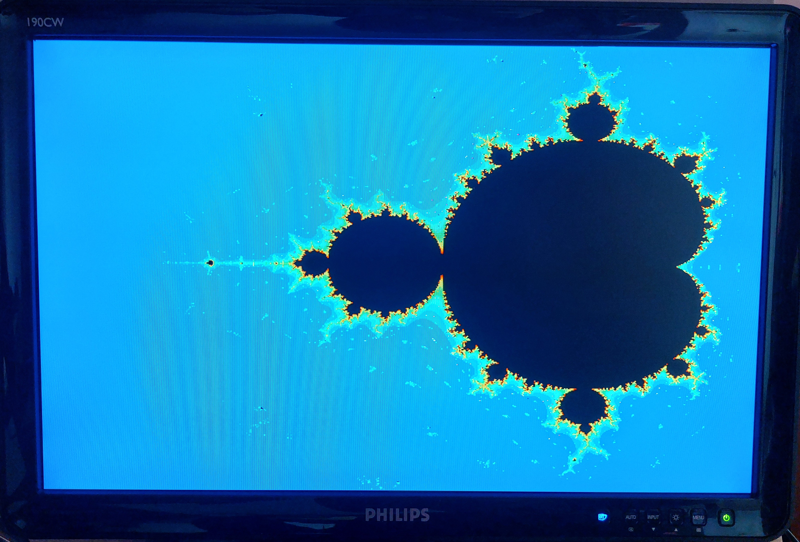

# A Mandelbrot Set story :  FPGA based

> Real-time hardware rendering of the Mandelbrot set based on the Basys3 FPGA and a VGA monitor.
> Project based on Vivado and VHDL


## Mandelbrot Set

The Mandelbrot set contains all complex numbers c for which the following iterative sequence remains bounded:

$$
\begin{cases}
z_0 = 0 \\
z_{n+1} = z_n^2 + c
\end{cases}
$$

where

$$
c = \mathrm{Re} + j \cdot \mathrm{Im}
$$

With Re being the real part, and Im being the imaginary part. Each point in the complex plane is iteratively evaluated to determine whether the sequence diverges or remains bounded.


## Get started

### 1. Clone

Open PowerShell in your Vivado projects folder and run:

```bash
git clone https://github.com/Elfix3/Mandelbrot-Renderer.git
cd Mandelbrot-Renderer
```

### 2. Recreate the Vivado project

Launch Vivado → **Window → Tcl Console** and run:

```tcl
cd "C:/path/to/your/Mandelbrot-Renderer"
source mandelbrot_plot.tcl
```

> Wait for the script to complete. This will generate a `mandelbrot_plot/` folder.

### 3. Open the project

1. In Vivado, click **Open Project**
2. Navigate to `Mandelbrot-Renderer/mandelbrot_plot/`
3. Select `mandelbrot_plot.xpr`

### 4. You're all set!
You can now run synthesis and implementation 🎉

## Quick overview

*coming soon*

## Architecture

The architecture follows a clear modular design, from the button inputs to the VGA outputs.



## Results 


#### A few figures


| Metrics    | Value     |
| ---------- | --------- |
| LUT usage  | 686/20800 |
| FF usage   | 333/41600 |
| DSP usage  | 3/90      |
| BRAM usage | 37.5 %    |
| Frequency  | 100 MHz   |

#### Display on a VGA monitor


## Road map


### To do

- [ ] 🔴 Add more calculations unit to the frame processing module
- [ ] 🟠 UART debugging interface
- [ ] 🟠 Memoryless real time rendering
- [ ] 🟢 Merge to a a higher fixed point resolution calculation
###  In progress

- [ ] 🟠 Improve the zoom functionalities (zoom feature non stable for high zoom levels)
- [ ] 🟠 Improve the documentation quality

### Done

- [x] Hardware testing on the Basys3
- [x] Debug of the timing closures
- [x] Design of the top level module and connexion with all the signals
- [x] Behavioral simulation of the Frame Processing Unit
- [x] Design of the Frame Processing Unit
- [x] Instanciation of the true dual-port BRAM IP 
- [x] Behavioral simulation of the zoom manager
- [x] Design of the zoom manager module
- [x] Design of the iteration  -> level converter 
- [x] Behavioral and post-implementaiton simulation of the Calculation unit
- [x] Integration of all the square operations on a Q3.13 fixed point arithmetic
- [x] Design of the Calculation unit to compute mandelbrot iterations
- [x] Simulation and hardware testing of the VGA controler
- [x] Instanciation of the Xilinx MMCM ip to generate both 100MHz and 25.125 MHz clocks
- [x] Implementation of the VGA controller


